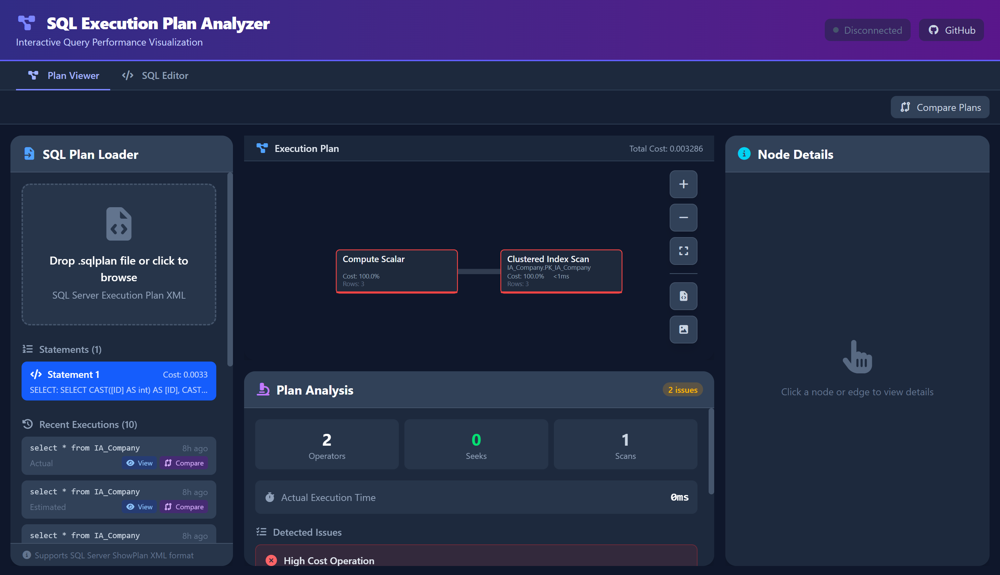

# SQL Plan For Dummies

[](LICENSE)
[](https://github.com/PsyChonek/SqlPlanForDummies)

An interactive SQL Execution Plan Viewer and Extended Events Analyzer built with Tauri + Vue + D3.js that provides visual analysis and performance insights for query execution plans and XEL traces.



## Quick Start

1. **Install**: `winget install PsyChonek.SqlPlanForDummies`
2. **Get a plan**: In SSMS, enable "Include Actual Execution Plan" (Ctrl+M), run your query, and save as `.sqlplan`
3. **Analyze**: Drag the `.sqlplan` file into the app and review performance insights

## Features

- **Interactive D3.js Visualization**: Color-coded nodes with performance indicators, operator icons, and dynamic line thickness
- **Detailed Node Inspection**: CPU time, I/O cost, memory grants, row counts, predicates, and execution statistics with searchable properties
- **Automated Analysis**: Detects table scans, missing indexes, implicit conversions, spills, and other performance issues
- **Plan Comparison**: Side-by-side visual comparison with cost delta analysis
- **Tabbed Plan View**: Switch between execution plan visualization and analysis results in a tabbed interface
- **XEL Analyzer** *(Windows only)*: Extended Events (.xel/.xml) analysis with:
  - Event timeline and filterable event table
  - Deadlock detection and deadlock graph visualization
  - Blocking chain correlation and lock chain diagrams
  - Wait statistics dashboard with D3.js charts
  - Session analysis and problem diagnostics
- **Query History**: Searchable history of executed queries with one-click plan loading
- **Node Search**: Filter node properties by keyword with match highlighting
- **Export Options**: PNG, SVG, and JSON export
- **Native Desktop App**: Fast, lightweight, offline-capable with auto-updates

## Roadmap

- [x] **Tabbed Interface**: Tabbed plan view with execution plan and analysis tabs
- [x] **Node Search**: Filter node properties by keyword
- [x] **XEL Analyzer**: Extended Events file analysis with deadlock and blocking diagnostics
- [ ] **Dark/Light Mode**: Theme toggle
- [ ] **SSMS Integration**: Right-click menu to open plans directly
- [ ] **Index Advisor**: AI-powered CREATE INDEX script generation
- [ ] **Command Line Interface**: CI/CD integration support
- [ ] **PostgreSQL/MySQL Support**: EXPLAIN format parsing

## Installation

**Winget (Recommended):**

```bash
winget install PsyChonek.SqlPlanForDummies
```

**MSI Installer:**
Download from [Releases](https://github.com/PsyChonek/SqlPlanForDummies/releases)

**Build from Source:**

```bash
git clone https://github.com/PsyChonek/SqlPlanForDummies.git
cd SqlPlanForDummies
npm install
npm run tauri dev    # Development
npm run tauri build  # Production build
```

Prerequisites: Node.js 18+, Rust, WebView2

## Usage

**Getting a Plan from SSMS:**

1. Enable "Include Actual Execution Plan" (Ctrl+M)
2. Run your query
3. Right-click the plan → "Save Execution Plan As..." → `.sqlplan`

**Analyzing Plans:**

1. **Load**: Drag & drop `.sqlplan` file into the app
2. **Navigate**: Click/drag to pan, scroll to zoom, arrow keys to move between nodes
3. **Inspect**: Click nodes to view details, costs, and predicates
4. **Search**: Use the search box to filter node properties by keyword
5. **Analyze**: Switch to the Analysis tab for automated performance warnings
6. **Compare**: Load a second plan for side-by-side comparison
7. **Export**: Save as PNG or SVG

**Analyzing Extended Events (Windows only):**

1. **Load**: Drag & drop `.xel` or exported `.xml` Extended Events files
2. **Browse**: Filter and sort events in the event table
3. **Timeline**: View event distribution over time in the Gantt-style timeline
4. **Deadlocks**: Review detected deadlock graphs and victim processes
5. **Blocking**: Inspect blocking chain diagrams to find root blockers
6. **Dashboard**: Check wait statistics and problem summary metrics

## Technology Stack

- **Frontend**: Vue 3 + TypeScript + Vite
- **Visualization**: D3.js v7
- **Desktop**: Tauri 2.0 (Rust + WebView2)
- **Supported**: SQL Server 2012+ `.sqlplan` files (SSMS, Azure Data Studio)

## FAQ

**Q: Is my data sent anywhere?**
A: No. The app runs entirely offline on your machine.

**Q: What file types are supported?**
A: SQL Server `.sqlplan` execution plan files and `.xel`/`.xml` Extended Events files. XEL analysis requires Windows with PowerShell.

**Q: Does this work with PostgreSQL/MySQL?**
A: Not yet. Only SQL Server formats are currently supported.

**Q: WebView2 not found error?**
A: Install [Microsoft Edge WebView2 Runtime](https://developer.microsoft.com/microsoft-edge/webview2/).

## Contributing

Contributions welcome! Fork the repo, create a feature branch, and open a PR. Follow the existing code style (ESLint + Prettier).

## License

MIT License - see [LICENSE](LICENSE) for details.

---

Made for SQL Server DBAs and Developers by [@PsyChonek](https://github.com/PsyChonek)
