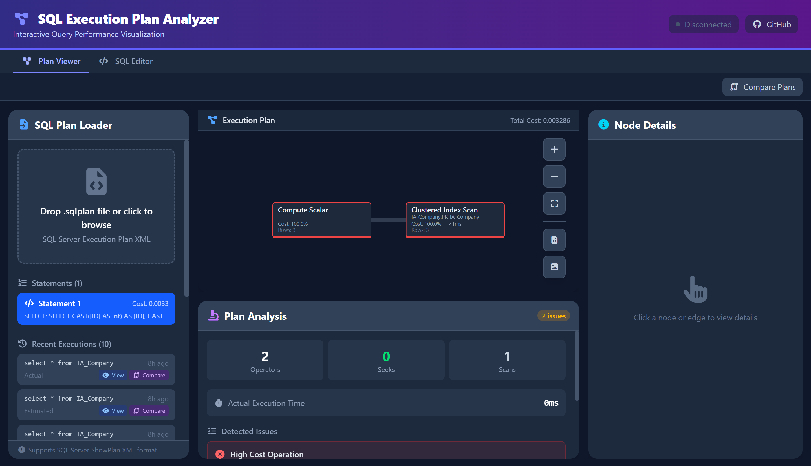

# SQL Plan For Dummies

[](LICENSE)
[](https://github.com/PsyChonek/SqlPlanForDummies)

An interactive SQL Execution Plan Viewer, SQL Editor and Extended Events Analyzer built with Tauri + Vue + D3.js that provides visual analysis and performance insights for query execution plans and XEL traces.



## Quick Start

1. **Install**: `winget install PsyChonek.SqlPlanForDummies`
2. **Get a plan**: In SSMS, enable "Include Actual Execution Plan" (Ctrl+M), run your query, and save as `.sqlplan` - or connect to your server in the SQL Editor tab and run the query there
3. **Analyze**: Drag the `.sqlplan` file into the app and review performance insights

## Features

The app has three top-level tabs: **Plan Viewer**, **SQL Editor**, and **XEL Analyzer** (Windows only).

### Plan Viewer

- **Interactive D3.js Visualization**: Color-coded nodes with performance indicators, operator icons, and dynamic line thickness
- **Detailed Node Inspection**: CPU time, I/O cost, memory grants, row counts, predicates, and execution statistics with searchable properties
- **Automated Analysis**: Detects table scans, key lookups, implicit conversions, tempdb spills, cardinality estimate mismatches, missing join predicates, and memory grant problems
- **Plan Overview**: Per-statement summary table (cost, elapsed, CPU, waits, warnings) for multi-statement plans, plus aggregated wait statistics and optimizer missing-index suggestions
- **Wait Statistics**: Statement-level `WaitStats` and `QueryTimeStats` with plain-language explanations of each wait type
- **Blocking Detection**: Lock waits (`LCK_M_*`) are flagged on the statement list and reported separately from plan cost, so a slow query blocked by another session is not mistaken for a bad plan
- **Multi-Statement Plans**: Batches are merged into a single plan; statements can be sorted by cost or elapsed time
- **Plan Comparison**: Side-by-side visual comparison with cost delta analysis
- **Tabbed Plan View**: Execution plan, analysis, query text, raw XML, and plan overview tabs
- **Node Search**: Filter node properties by keyword with match highlighting
- **Export Options**: PNG, SVG, and JSON export

### SQL Editor

- **SQL Server Connections**: Saved connections with a connection manager in the header
- **Query Execution**: Run statements with CodeMirror SQL editing (syntax highlighting, autocomplete)
- **Plan Capture**: Execute with no plan, an estimated plan, or an actual plan and send the result straight to the Plan Viewer
- **Results and Messages**: Result grid, server messages, row counts, and execution duration in tabbed output
- **Query History**: Searchable history of executed queries with one-click plan loading

### XEL Analyzer *(Windows only)*

- Extended Events (`.xel` / `.xml`) analysis with:
  - Event timeline and filterable event table
  - Deadlock detection and deadlock graph visualization
  - Blocking chain correlation and lock chain diagrams
  - Wait statistics dashboard with D3.js charts
  - Session analysis and problem diagnostics

Everything runs as a **native desktop app**: fast, lightweight, offline-capable, with update notifications through WinGet on Windows.

## Roadmap

- [x] **Tabbed Interface**: Tabbed plan view with execution plan and analysis tabs
- [x] **Node Search**: Filter node properties by keyword
- [x] **XEL Analyzer**: Extended Events file analysis with deadlock and blocking diagnostics
- [x] **SQL Editor**: Connect to SQL Server, run queries, and capture estimated/actual plans
- [x] **Plan Overview**: Multi-statement summary with waits, warnings, and missing indexes
- [ ] **Dark/Light Mode**: Theme toggle
- [ ] **SSMS Integration**: Right-click menu to open plans directly
- [ ] **Index Advisor**: AI-powered CREATE INDEX script generation
- [ ] **Command Line Interface**: CI/CD integration support
- [ ] **PostgreSQL/MySQL Support**: EXPLAIN format parsing

## Installation

**Winget (Recommended):**

```bash
winget install PsyChonek.SqlPlanForDummies
```

**MSI Installer:**
Download from [Releases](https://github.com/PsyChonek/SqlPlanForDummies/releases)

**Updating on Windows:**
The app checks WinGet at startup and offers an update when a newer version is available.
Use **Check for updates** in the header to check manually. Choose **Update with WinGet**
to start the Windows installer, or **Later** to keep working. Save open queries before
updating, follow any installer prompts, and restart the app when the update finishes.
WinGet must be available through Microsoft's App Installer, and the app must be an
installed copy recognized by WinGet. Updates appear after the new version reaches
the WinGet catalog. Startup check failures do not interrupt your work; a manual check
shows any error details.

**Build from Source:**

```bash
git clone https://github.com/PsyChonek/SqlPlanForDummies.git
cd SqlPlanForDummies
npm install
npm run tauri dev    # Development
npm run tauri build  # Production build
```

Prerequisites: Node.js 18+, Rust, WebView2

**Other scripts:**

```bash
npm run dev            # Frontend only, in the browser (http://localhost:5173)
npm run build          # Bump patch version, build the MSI, copy it to dist/
npm run build:minor    # Same, bumping the minor version (also: build:major)
npm run build:frontend # Type-check and build the frontend only
npm run test           # Vitest in watch mode (test:run for a single pass)
npm run test:coverage  # Vitest with coverage
npm run test:rust      # Cargo tests for the Tauri backend
```

## Usage

**Getting a Plan from SSMS:**

1. Enable "Include Actual Execution Plan" (Ctrl+M)
2. Run your query
3. Right-click the plan → "Save Execution Plan As..." → `.sqlplan`

**Analyzing Plans:**

1. **Load**: Drag & drop `.sqlplan` file into the app
2. **Overview**: Open the Plan Overview tab to see all statements ranked by cost, elapsed time, waits, and warnings, then click one to jump to its graph
3. **Navigate**: Click/drag to pan, scroll to zoom, arrow keys to move between nodes
4. **Inspect**: Click nodes to view details, costs, and predicates
5. **Search**: Use the search box to filter node properties by keyword
6. **Analyze**: Switch to the Analysis tab for automated performance warnings and wait statistics
7. **Compare**: Load a second plan for side-by-side comparison
8. **Export**: Save as PNG or SVG

**Running Queries (SQL Editor tab):**

1. **Connect**: Click the connection status in the header and add a SQL Server connection
2. **Write**: Enter a query in the editor
3. **Choose a plan type**: None, Estimated, or Actual
4. **Run**: Execute the query and review results and messages in the output panel
5. **Analyze**: Captured plans open in the Plan Viewer; earlier runs stay in Query History

**Analyzing Extended Events (Windows only):**

1. **Load**: Drag & drop `.xel` or exported `.xml` Extended Events files
2. **Browse**: Filter and sort events in the event table
3. **Timeline**: View event distribution over time in the Gantt-style timeline
4. **Deadlocks**: Review detected deadlock graphs and victim processes
5. **Blocking**: Inspect blocking chain diagrams to find root blockers
6. **Dashboard**: Check wait statistics and problem summary metrics

## Technology Stack

- **Frontend**: Vue 3 + TypeScript + Vite + Tailwind CSS
- **Visualization**: D3.js v7
- **SQL Editing**: CodeMirror 6
- **Desktop**: Tauri 2.0 (Rust + WebView2)
- **Testing**: Vitest + Vue Test Utils
- **Supported**: SQL Server 2012+ `.sqlplan` files (SSMS, Azure Data Studio). Wait statistics require actual plans from SQL Server 2016 SP1+

## FAQ

**Q: Is my data sent anywhere?**
A: No. The app runs entirely offline on your machine, and it only talks to the SQL Server instances you connect to yourself.

**Q: What file types are supported?**
A: SQL Server `.sqlplan` execution plan files and `.xel`/`.xml` Extended Events files. XEL analysis requires Windows with PowerShell.

**Q: My query is slow but the plan looks fine. Why?**
A: Check the Waits column in Plan Overview. A lock icon means the statement was blocked by another session, so the time was spent waiting rather than executing.

**Q: Does this work with PostgreSQL/MySQL?**
A: Not yet. Only SQL Server formats are currently supported.

**Q: WebView2 not found error?**
A: Install [Microsoft Edge WebView2 Runtime](https://developer.microsoft.com/microsoft-edge/webview2/).

## Contributing

Contributions welcome! Fork the repo, create a feature branch, and open a PR. Follow the existing code style and conventions described in [AGENTS.md](AGENTS.md), and run `npm run test:run` before opening the PR.

## License

MIT License - see [LICENSE](LICENSE) for details.

---

Made for SQL Server DBAs and Developers by [@PsyChonek](https://github.com/PsyChonek)
